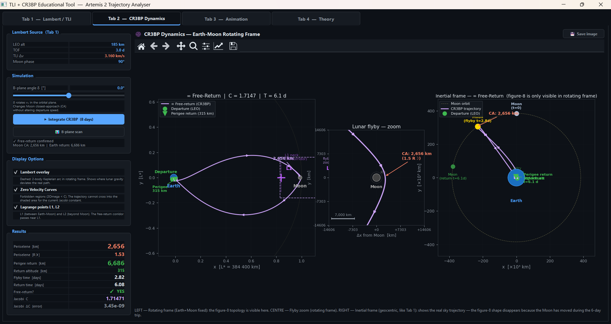
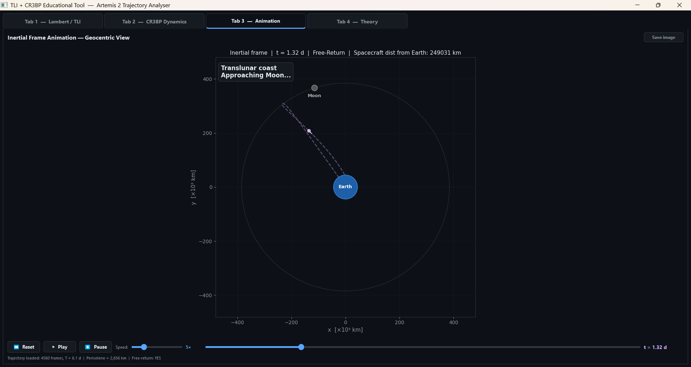
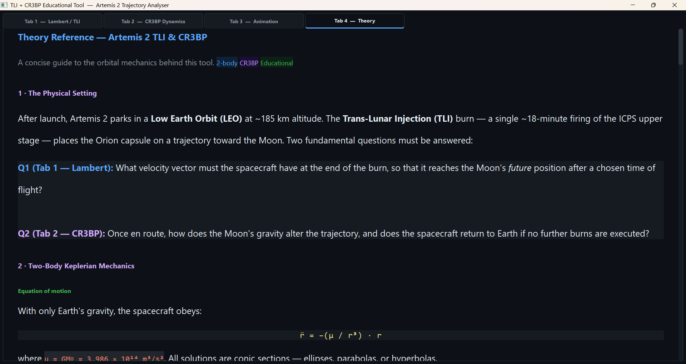

# Free Return Moon Trajectory Calculator
### *Artemis 2 — Simplified Educational Simulator*

A desktop Python application that simulates and visualises the physics of a
**Trans-Lunar Injection (TLI)** burn and a **free-return trajectory** around
the Moon, using Artemis 2 as the central educational example.

The tool is intentionally simplified for clarity — it is a **teaching instrument**,
not a mission-grade simulator.

---

## Screenshots

> *Replace the placeholders below with actual screenshots after first run.*

| Tab 1 — Lambert / TLI | Tab 2 — CR3BP Dynamics |
|:---:|:---:|
|  |  |

| Tab 3 — Animation | Tab 4 — Theory |
|:---:|:---:|
|  |  |

---

## What the tool does

### Tab 1 — Lambert / TLI
Solves the **Lambert boundary-value problem**: given a LEO parking orbit,
a time of flight, and a transfer arc angle, finds the unique Keplerian
ellipse that connects Earth departure to the Moon's *future* position.

**Key educational insight:** TLI does not aim at the Moon's current position
but at where it will be after the chosen time of flight.

Outputs: Δv, departure/arrival velocities, apogee radius, Δv vs arc curve.

### Tab 2 — CR3BP Dynamics
Integrates the spacecraft trajectory under the **Circular Restricted
Three-Body Problem** (Earth + Moon + spacecraft). Shows how the Moon's
gravity deviates the path from the Keplerian conic, and whether the
trajectory returns to Earth autonomously (free-return condition).

Three simultaneous views:
- **Rotating frame** — Earth and Moon fixed; figure-8 topology visible
- **Flyby zoom** — close-up of the periselene passage with km scale
- **Inertial frame** — geocentric view comparable to Tab 1

### Tab 3 — Animation
Animated playback of the CR3BP trajectory in the geocentric inertial frame.
Earth is fixed at centre; Moon moves along its circular orbit; the spacecraft
follows with a fading trail. Mission-phase annotations mark TLI, flyby,
and Earth return in real time.

### Tab 4 — Theory
Scrollable reference card covering the full theoretical background:
two-body mechanics, Lambert's problem, CR3BP equations, Lagrange points,
Jacobi constant, free-return corridor, and an annotated bibliography.

---

## Physics model

| Feature | This tool | Reality |
|---|---|---|
| Gravity | Earth + Moon (CR3BP) | N-body (Sun, planets…) |
| Orbits | Circular LEO + circular Moon orbit | Elliptic, perturbed |
| Plane | 2D coplanar | 3D, Moon inclined ~5.1° |
| Burn | Instantaneous (impulsive) | ~18 min ICPS burn |
| Periselene (model) | ~2 600 km | ~7 400 km (Artemis 2) |
| Return perigee (model) | ~315 km altitude | ~120 km entry interface |
| Total TOF (model) | ~6 days | ~10 days (hybrid free-return) |

These simplifications are **intentional** — they make the physics transparent
without obscuring the key concepts.

---

## Mathematical background

### Part 1 — Lambert's Problem and the TLI solver

#### The problem statement

Lambert's problem (Johann Heinrich Lambert, 1761) is the fundamental
boundary-value problem of orbital mechanics:

> **Given** two position vectors **r**₁ and **r**₂ and a time of flight Δt,
> **find** the unique conic section (ellipse, parabola, or hyperbola)
> connecting them, and the velocity vectors **v**₁, **v**₂ at each endpoint.

For TLI, **r**₁ is the departure point on the LEO circle and **r**₂ is
the Moon's *future* position — propagated forward by Δt along its circular
orbit. The Moon travels roughly 40° during a 3-day transfer, so the solver
must target where the Moon *will be*, not where it *is*.

#### Why it is non-trivial

Forward propagation (given **r**₀, **v**₀ → find **r**(t)) is a simple
integration. Lambert is the inverse: given two endpoints and a duration,
find the initial velocity. This boundary-value formulation is inherently
nonlinear — there is no closed-form solution for the velocity, only for
the geometry.

Lambert proved that the time of flight depends only on three scalar
quantities: the semi-major axis *a*, the chord length
*c* = |**r**₂ − **r**₁|, and the semi-perimeter
*s* = (r₁ + r₂ + c) / 2. This elegant result reduces an apparently
six-dimensional problem to a one-dimensional root-finding exercise.

#### Two-body baseline: vis-viva and the Hohmann limit

All Keplerian orbits satisfy the **vis-viva equation**:

```
v² = μ · (2/r − 1/a)
```

where μ = GM⊕ and *a* is the semi-major axis. At LEO radius r₁:

```
v_circ = √(μ / r₁)  ≈  7.79 km/s   (LEO at 185 km)
```

The most energy-efficient transfer to the Moon is the **Hohmann transfer**,
where departure and arrival are antipodal (transfer arc Δν = 180°) and the
ellipse apogee equals the Moon's orbital radius:

```
a_Hohmann = (r_LEO + r_Moon) / 2  =  (6 556 + 384 400) / 2  ≈  195 478 km

v_departure = √(μ · (2/r_LEO − 1/a))  ≈  10.85 km/s

ΔvTLI = v_departure − v_circ  ≈  3.06 km/s
```

For non-Hohmann transfers (Δν < 180°), the Moon is intercepted before
apogee — the true apogee of the transfer ellipse lies *beyond* the Moon
at ~510 000 km. The cost in Δv rises as Δν decreases from 180°.

#### The transfer arc angle Δν and the Δv curve

The **Transfer Arc slider** in Tab 1 controls the geocentric angle between
the departure point on LEO and the Moon's future position. It determines
which point on the LEO circle is used for departure — equivalently, it
selects one member from the continuous family of Lambert solutions.

The relationship between Δν and Δv is shown in the right panel of Tab 1.
The curve has a clear minimum near Δν ≈ 172°–178° (the near-Hohmann
region), and rises steeply for short arcs (Δν < 130°) where the
trajectory must curve sharply to connect two non-antipodal points.

#### The universal-variable solver (Battin / Bate)

The implementation uses the **universal variable formulation**, which
handles elliptic, parabolic, and hyperbolic orbits in a single unified
framework via the **Stumpff functions** C(ψ) and S(ψ):

```
         1 − cos(√ψ)               √ψ − sin(√ψ)
C(ψ) = ─────────────   ,   S(ψ) = ─────────────    [ψ > 0, elliptic]
              ψ                          ψ^(3/2)

         cosh(√−ψ) − 1             sinh(√−ψ) − √−ψ
C(ψ) = ─────────────────   ,  S(ψ) = ───────────────    [ψ < 0, hyperbolic]
              −ψ                           (−ψ)^(3/2)
```

These functions converge smoothly to 1/2 and 1/6 as ψ → 0 (parabolic
limit), eliminating the need for case branching.

A geometric parameter A is constructed from the position vectors:

```
A = sin(Δν) · √(r₁·r₂ / (1 − cos Δν))
```

The time-of-flight equation then becomes a scalar function of ψ:

```
y(ψ) = r₁ + r₂ + A · (ψ·S(ψ) − 1) / √C(ψ)

√μ · Δt = [y(ψ)/C(ψ)]^(3/2) · S(ψ)  +  A · √y(ψ)
```

This is solved with **Brent's method** (`scipy.optimize.brentq`), which
guarantees convergence with tolerance xtol = 10⁻¹². Once ψ* is found,
the velocity vectors follow from the **Lagrange f-g coefficients**:

```
f  = 1 − y/r₁
g  = A · √(y/μ)
gd = 1 − y/r₂

v₁ = (r₂ − f·r₁) / g
v₂ = (gd·r₂ − r₁) / g
```

The TLI burn magnitude is the vector difference:

```
ΔvTLI = |v₁ − v_circ|
```

where **v**_circ is the circular velocity tangent to LEO at the departure
point. Numerically validated: Δv ≈ 3.16 km/s for arc = 172°, LEO = 185 km,
TOF = 3.0 days.

---

### Part 2 — Circular Restricted Three-Body Problem (CR3BP)

#### Why a new model is needed

The Lambert solver treats the Moon as a massless target — a point in space
with no gravitational influence. This is accurate for the first 2–3 days of
transit, but breaks down as the spacecraft enters the Moon's **sphere of
influence** (~66 000 km radius). Inside this sphere, lunar gravity produces
deviations of hundreds to thousands of kilometres from the Lambert conic.
The CR3BP captures this physics with minimum added complexity.

#### Hypotheses and dimensionless units

The CR3BP makes four simplifying assumptions:

| Assumption | Physical justification |
|---|---|
| Circular Earth–Moon orbit | Lunar orbital eccentricity ≈ 0.055, small |
| Spacecraft mass negligible | m_Orion / m_Moon ≈ 10⁻¹⁸ |
| Planar (2D) motion | Moon inclination ≈ 5.1°, omitted for clarity |
| No other perturbations | Solar gravity, J₂ are second-order over 6 days |

The problem is nondimensionalised with natural units:

```
μ  =  M_Moon / (M_Earth + M_Moon)  ≈  0.012 15   (mass ratio)
L* =  384 400 km                                   (Earth–Moon distance)
T* =  T_Moon / 2π  ≈  4.343 days                  (1/mean motion)
V* =  L* / T*      ≈  1.023 km/s                  (velocity unit)
```

In the rotating frame (rotating at the Moon's mean motion ω = 1):

- Earth is fixed at **(−μ, 0)**
- Moon is fixed at **(1−μ, 0)**
- All distances, times, and velocities are expressed in L*, T*, V*

#### Equations of motion

In the rotating frame the spacecraft obeys:

```
ẍ − 2ẏ = ∂Ω/∂x
ÿ + 2ẋ = ∂Ω/∂y
```

The terms **−2ẏ** and **+2ẋ** are the **Coriolis acceleration** — they
arise purely from the rotating reference frame and have no counterpart in
the inertial-frame equations. The effective potential Ω combines gravity
from both bodies with the centrifugal term:

```
Ω(x,y) = ½(x² + y²)  +  (1−μ)/r₁  +  μ/r₂
```

where r₁ = distance from Earth, r₂ = distance from Moon. The gradient
∂Ω/∂x is:

```
∂Ω/∂x = x − (1−μ)(x+μ)/r₁³ − μ(x−(1−μ))/r₂³
```

and similarly for ∂Ω/∂y.

#### The Jacobi constant — the only conserved quantity

Unlike the two-body problem (which has six integrals of motion), the CR3BP
has only **one**: the Jacobi constant

```
C = 2Ω(x,y) − v²    where  v² = ẋ² + ẏ²
```

C plays the role of total energy in the rotating frame. It is exactly
conserved along any trajectory (no dissipation, no thrust). The numerical
integrator validates this: ΔC < 10⁻⁸ over 8 days using DOP853 with
rtol = 10⁻¹⁰.

#### Zero Velocity Curves and forbidden regions

Setting v² = 0 in the Jacobi constant gives the **Zero Velocity Curves**
(ZVC): surfaces where the spacecraft momentarily has zero speed. They are
defined by:

```
2Ω(x,y) = C
```

The region where **2Ω < C** is **forbidden** — a spacecraft with Jacobi
constant C cannot enter it regardless of trajectory. As C decreases (more
energy), the forbidden regions shrink, progressively opening "necks" around
the Lagrange points L1 and L2. These are shown as shaded regions in Tab 2.

| C value | Topology |
|---|---|
| C > C_L1 = 3.188 | Spacecraft confined near Earth or Moon — no transit possible |
| C_L2 < C < C_L1 | L1 neck open — Earth ↔ Moon transit possible |
| C < C_L2 = 3.172 | Both necks open — free transit through L1 and L2 |
| **C ≈ 1.71 (Artemis baseline)** | Both necks wide open — full system accessible |

#### Lagrange equilibrium points

Five points where the effective force vanishes in the rotating frame —
i.e. where ∂Ω/∂x = ∂Ω/∂y = 0. The three collinear points (L1, L2, L3)
lie on the Earth–Moon axis and are found numerically (Brent's method).
The two equilateral points (L4, L5) are at (0.5−μ, ±√3/2).

```
L1:  x ≈ 0.8369 L*   (between Earth and Moon)   — unstable
L2:  x ≈ 1.1557 L*   (beyond Moon)               — unstable
L3:  x ≈ −1.005 L*   (opposite Moon)             — unstable
L4:  (0.488, +0.866)  (60° ahead of Moon)         — linearly stable
L5:  (0.488, −0.866)  (60° behind Moon)           — linearly stable
```

L1 and L2 are the gateways for translunar and cislunar trajectories. The
free-return corridor passes through the stable/unstable manifolds of L1.

#### Free-return trajectory and B-plane targeting

A **free-return trajectory** satisfies the constraint that the spacecraft
returns to Earth's atmosphere after the lunar flyby with no additional burns.
In the rotating frame it appears as the iconic **figure-8**: the outbound
leg passes above the Earth–Moon axis, the flyby deflects the trajectory
around the Moon, and the return leg falls below the axis back toward Earth.

The free-return condition is extremely sensitive to the initial conditions.
Rotating the departure velocity **v**₁ by a small angle **δ** in the
orbital plane (B-plane targeting) changes the Moon closest approach
distance dramatically:

```
δ = 0°    →   periselene ≈ 2 656 km,  Earth return ≈ 315 km altitude  ✓ FR
δ = +0.5° →   periselene ≈ 7 659 km,  Earth return ≈ 200 000 km        ✗
δ = −0.5° →   periselene ≈   548 km,  Earth return ≈ 204 000 km        ✗
```

The free-return corridor has a total width of **~0.6°** in δ. In real
missions this is controlled by Trajectory Correction Maneuvers (TCM)
of a few m/s executed 1–3 days after TLI.

#### Numerical integration

The CR3BP state vector [x, y, ẋ, ẏ] is integrated with **DOP853**
(8th-order Dormand–Prince), via `scipy.integrate.solve_ivp`:

```python
solve_ivp(cr3bp_eom, [0, t_final], state0,
          method="DOP853", rtol=1e-10, atol=1e-12)
```

DOP853 is chosen over lower-order methods (RK45, RK23) because the CR3BP
has sensitive dependence on initial conditions near the Moon — higher order
gives significantly better Jacobi conservation for the same computational cost.
Typical result: ΔC ≈ 3 × 10⁻⁹ after 8 days, ~4 500 output points.

---

## Installation

### Requirements

```
Python >= 3.10
PyQt5 >= 5.15
matplotlib >= 3.7
numpy >= 1.24
scipy >= 1.10
```

Install all dependencies:

```bash
pip install -r requirements.txt
```

### Run

```bash
python tli_gui.py
```

No configuration needed. The window adapts to your screen resolution.

---

## Quick start

1. **Tab 1** — Leave default parameters (LEO 185 km, TOF 3.0 d, Arc 172°)
   and press **⟳ Recompute**. Observe Δv ≈ 3.16 km/s and the transfer arc.
   Try pressing **★ Min Δv** to find the optimal arc automatically.

2. **Tab 2** — Press **▶ Integrate CR3BP (8 days)**. The figure-8 topology
   appears in the rotating frame (left panel). The flyby zoom (centre) shows
   periselene distance. Use the **B-plane angle δ slider** to explore how
   ±0.3° changes the Moon closest approach and whether the free-return
   condition is satisfied.

3. **Tab 3** — Press **▶ Play** to watch the animated inertial-frame
   trajectory. Adjust playback speed with the slider.

4. **Tab 4** — Read the theory reference for the mathematical background.

---

## Controls reference

### Tab 1 — Lambert / TLI

| Control | Range | Effect |
|---|---|---|
| LEO Altitude | 150 – 1 000 km | Parking orbit altitude |
| Time of Flight | 2.0 – 5.0 days | Transfer duration |
| Moon Phase | 0 – 360° | Initial Moon position (cosmetic) |
| Transfer Arc | 91 – 179° | Geocentric angle departure → arrival |
| ★ Min Δv | — | Finds arc that minimises Δv |

### Tab 2 — CR3BP

| Control | Range | Effect |
|---|---|---|
| B-plane angle δ | −5° … +5° | Rotates v₁; changes Moon CA |
| ▶ Integrate | — | Runs 8-day CR3BP integration |
| 📊 B-plane scan | — | Sweeps δ; maps free-return corridor |

---

## Key physics parameters

```
μ_Earth  =  3.986 004 418 × 10¹⁴  m³/s²
μ_Moon   =  4.902 800 066 × 10¹²  m³/s²
μ_CR3BP  =  M_Moon / (M_Earth + M_Moon)  ≈  0.012 15
L*       =  384 400 km   (Earth–Moon distance)
T*       =  T_Moon / 2π  ≈  4.343 days
R_Earth  =  6 371 km
R_Moon   =  1 737.4 km
```

---

## Architecture

```
tli_gui.py                 Single-file application (~3 000 lines)
│
├── Physics functions
│   ├── lambert_uv()         Universal-variable Lambert solver (Bate/Battin)
│   ├── propagate_keplerian()  Kepler propagator with Newton-Raphson
│   ├── run_cr3bp_full()     DOP853 CR3BP integrator (scipy.solve_ivp)
│   ├── scan_bplane()        B-plane sweep for free-return corridor
│   ├── lagrange_points()    L1–L5 via Brent root-finding
│   └── lambert_to_cr3bp_ic()  Frame conversion: inertial SI → rotating nd
│
├── GUI classes
│   ├── TLIWindow            Main window with QTabWidget
│   ├── CR3BPTab             Tab 2: three-panel CR3BP visualisation
│   ├── AnimationTab         Tab 3: animated inertial-frame playback
│   └── TheoryTab            Tab 4: HTML theory reference card
│
└── Numerical methods
    ├── Lambert solver       Stumpff functions C(ψ), S(ψ) + brentq
    ├── Kepler propagator    Newton-Raphson on Kepler's equation
    └── CR3BP integrator     DOP853, rtol=1e-10, atol=1e-12
```

---

## References

- **Bate, Mueller & White** — *Fundamentals of Astrodynamics* (Dover, 1971)
  — Lambert solver, Kepler propagator
- **Battin, R.H.** — *An Introduction to the Mathematics and Methods of Astrodynamics*
  (AIAA, 1987) — Stumpff functions, universal variable formulation
- **Szebehely, V.** — *Theory of Orbits* (Academic Press, 1967)
  — CR3BP theory, Lagrange points, Zero Velocity Curves
- **Koon, Lo, Marsden & Ross** — *Dynamical Systems, the Three-Body Problem
  and Space Mission Design* (Springer, 2011) —
  [free PDF](http://www.cds.caltech.edu/~marsden/books/Mission_Design.html)
- **Vallado, D.A.** — *Fundamentals of Astrodynamics and Applications*
  (Microcosm, 4th ed. 2013)
- **NASA** — Artemis II Mission Overview —
  [nasa.gov/artemis](https://www.nasa.gov/artemis)

---

## Limitations and future work

**Current limitations:**
- 2D coplanar model (no Moon orbital inclination)
- Earth-only gravity for Lambert (Moon not a gravitational body in Tab 1)
- No solar pressure, J₂, or lunar gravity harmonics
- Impulsive burn (no finite burn arc)
- Circular Moon orbit (eccentricity ≈ 0.055 ignored)

**Possible extensions:**
- Lunar Orbit Insertion (LOI) burn — Tab 5
- Trans-Earth Injection (TEI) burn
- 3D trajectory (with Moon inclination)
- Real ephemerides via `astropy`/`spiceypy`
- Export to CSV / trajectory file

---

## Disclaimer

> **This application was generated through Vibe Coding with
> [Claude Sonnet 4.6](https://www.anthropic.com/claude) (Anthropic).**
>
> The physics, numerical methods, and educational content were developed
> iteratively through a human–AI collaboration. The orbital mechanics
> implementation follows established astrodynamics references (cited above)
> and has been validated against known results (Δv ≈ 3.1 km/s for
> Artemis-like TLI, Jacobi constant conservation ΔC < 10⁻⁸ over 8 days).
>
> This tool is intended **for educational purposes only**.
> It is not suitable for mission planning, navigation, or any safety-critical
> application. Results should not be compared directly to official Artemis 2
> mission data without accounting for the simplifications listed above.

---

## License

MIT License — free to use, modify, and distribute with attribution.

---

*Built with Python · PyQt5 · matplotlib · scipy · numpy*
